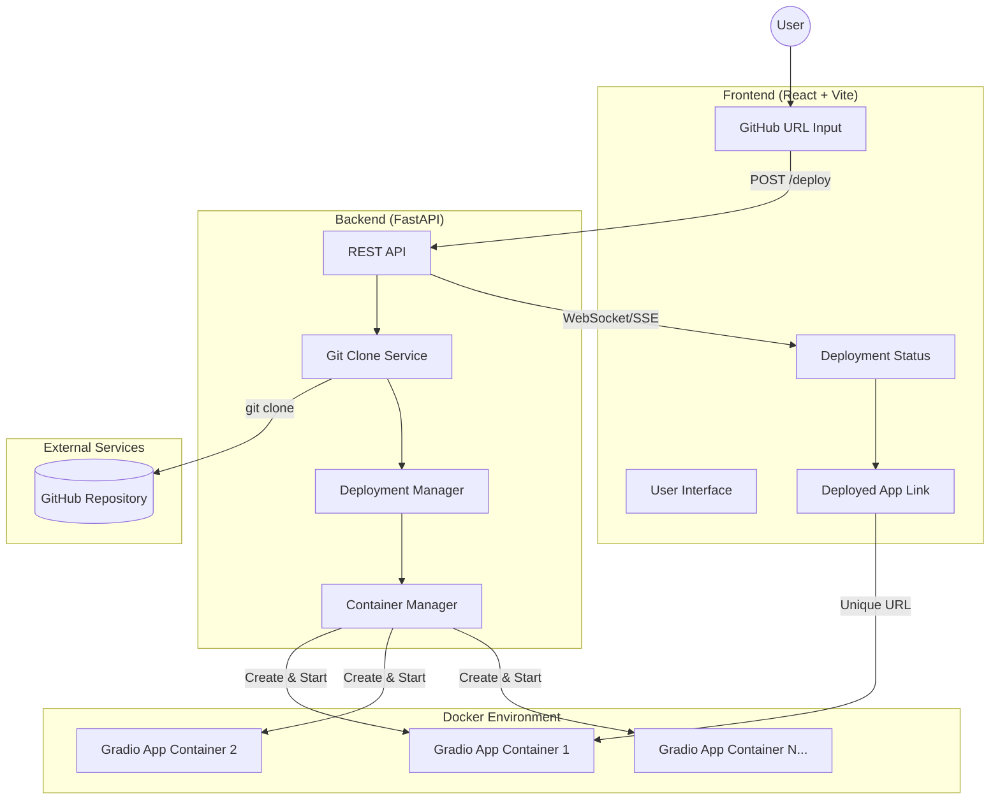
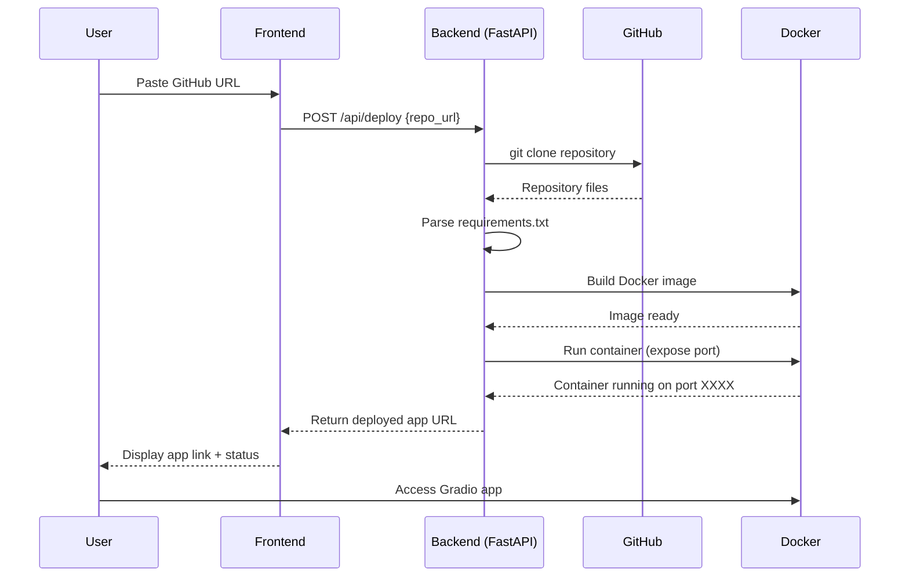

# DestinE Spaces

A self-hosted platform for deploying Gradio applications via GitHub repositories. Similar to Hugging Face Spaces, but runs on your own infrastructure with full GPU support.

## Features

- Deploy Gradio apps from any GitHub repository
- Automatic GPU support (NVIDIA CUDA)
- Isolated Docker containers for each deployment
- Real-time build and runtime logs
- Modern React frontend with dark mode
- Live deployment status monitoring

## Prerequisites

- Python 3.12+
- Node.js 18+
- Docker
- NVIDIA GPU with CUDA support (optional, falls back to CPU)
- Git

## Installation

### 1. Install uv (Python package manager)

```bash
curl -LsSf https://astral.sh/uv/install.sh | sh
```

### 2. Install Node.js dependencies

```bash
cd front-end
npm install
cd ..
```

### 3. Install Python dependencies

The project uses a uv workspace. Dependencies will be installed automatically when running the backend.

### 4. Verify NVIDIA persistence daemon (if using GPU)

```bash
sudo systemctl status nvidia-persistenced
```

If it's not running, start it:

```bash
sudo systemctl restart nvidia-persistenced
```

## Running the Application

### Start the Backend (Terminal 1)

```bash
cd backend
uv run uvicorn main:app --reload --port 8000
```

Or alternatively:

```bash
cd backend
uv run python main.py
```

The API will be available at `http://localhost:8000`

### Start the Frontend (Terminal 2)

```bash
cd front-end
npm run dev
```

The frontend will be available at `http://localhost:5173`

## Usage

1. Open your browser to `http://localhost:5173`
2. Navigate to the "Deploy" tab
3. Paste a GitHub repository URL containing a Gradio app
4. Add optional metadata (title, description, cover image)
5. Click "Deploy Space"
6. Monitor the build logs in real-time
7. Access your deployed app via the provided URL

## Architecture

### Architecture Diagram



---

## Sequence Diagram



---
### Backend (FastAPI)
- REST API with deployment endpoints
- Docker container orchestration
- Git repository cloning
- Real-time log streaming via SSE
- Port management (7860-7900)

### Frontend (React + Vite)
- Modern UI with React Router
- Real-time deployment monitoring
- Log viewer with build/runtime tabs
- Dark/light theme support
- Image upload for space covers

### Docker
- Each Gradio app runs in an isolated container
- Automatic GPU support with CPU fallback
- PyTorch CUDA base image
- Fast dependency installation via uv

## API Endpoints

| Method | Endpoint | Description |
|--------|----------|-------------|
| POST | `/api/deploy` | Deploy a new Gradio app |
| GET | `/api/spaces` | List all deployed spaces |
| GET | `/api/spaces/{id}` | Get space details |
| DELETE | `/api/spaces/{id}` | Stop and remove a space |
| GET | `/api/spaces/{id}/logs/build` | Get build logs |
| GET | `/api/spaces/{id}/logs/runtime` | Get container logs |
| GET | `/api/spaces/{id}/logs/stream` | Stream logs via SSE |
| POST | `/api/upload` | Upload a cover image |

## Development

### Backend Development

```bash
cd backend
uv run uvicorn main:app --reload --port 8000
```

### Frontend Development

```bash
cd front-end
npm run dev      # Start dev server
npm run build    # Production build
npm run lint     # Run ESLint
```

### Testing Docker Builds

```bash
# Build a test container
docker build -t test-app .
docker run -d --gpus all --name test-app -p 7860:7860 test-app

# View logs
docker logs -f test-app

# Cleanup
docker rm -f test-app
```

## Troubleshooting

### GPU Support Issues

If containers fail to start with GPU support:

1. Check NVIDIA drivers:
   ```bash
   nvidia-smi
   ```

2. Verify Docker runtime:
   ```bash
   docker info | grep -i runtime
   ```

3. Restart NVIDIA persistence daemon:
   ```bash
   sudo systemctl restart nvidia-persistenced
   ```

The platform will automatically fall back to CPU-only mode if GPU support is unavailable.

### Port Conflicts

If you see port binding errors, check which ports are in use:

```bash
docker ps
```

The platform manages ports 7860-7900 automatically.

## Project Structure

```
├── README.md
├── app.py
├── architecture.md
├── backend
│   ├── Dockerfile.template
│   ├── deployer.py
│   ├── main.py
│   ├── pyproject.toml
│   ├── repos
│   ├── requirements.txt
│   └── uploads
├── frontend
│   ├── README.md
│   ├── eslint.config.js
│   ├── index.html
│   ├── node_modules
│   ├── package-lock.json
│   ├── package.json
│   ├── public
│   ├── src
│   └── vite.config.js
├── main.py
├── pyproject.toml
└── uv.lock
```
